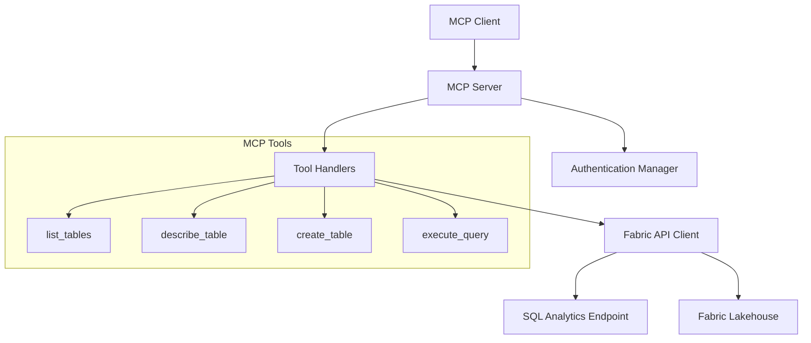

# Design Document

## Overview

The Microsoft Fabric Lakehouse MCP Server is a Python-based Model Context Protocol server that provides standardized access to Microsoft Fabric Lakehouse data operations. The server exposes tools for data structure inspection, table creation, and SQL query execution through the MCP protocol, enabling AI assistants and other MCP clients to interact with Fabric Lakehouse programmatically.

The server leverages the Fabric Lakehouse SQL Analytics Endpoint for read operations and the main Lakehouse interface for write operations, providing a unified interface for both data exploration and manipulation.

## Architecture

### High-Level Architecture



### Component Architecture

The server follows a layered architecture:

1. **MCP Protocol Layer**: Handles MCP protocol communication using FastMCP
2. **Tool Layer**: Implements business logic for each MCP tool
3. **API Client Layer**: Manages communication with Microsoft Fabric APIs
4. **Authentication Layer**: Handles various authentication methods
5. **Error Handling Layer**: Provides consistent error handling and logging

## Components and Interfaces

### 1. MCP Server Core

**FabricLakehouseMCPServer**
- Built using FastMCP from the MCP Python SDK
- Implements MCP protocol version 2025-06-18
- Manages server lifecycle and tool registration
- Handles client connections and protocol negotiation

### 2. Authentication Manager

**AuthenticationManager**
```python
class AuthenticationManager:
    def authenticate(self, method: str, credentials: dict) -> TokenCredential
    def refresh_token(self) -> bool
    def is_authenticated(self) -> bool
```

Supported authentication methods:
- Service Principal (client_id, client_secret, tenant_id)
- Managed Identity (for Azure-hosted environments)
- Interactive authentication (for development)

### 3. Fabric API Client

**FabricLakehouseClient**
```python
class FabricLakehouseClient:
    def __init__(self, workspace_id: str, lakehouse_id: str, credentials: TokenCredential)
    def get_tables(self) -> List[TableInfo]
    def get_table_schema(self, table_name: str) -> TableSchema
    def create_table(self, table_definition: TableDefinition) -> bool
    def execute_sql(self, query: str) -> QueryResult
```

### 4. MCP Tools

#### list_tables Tool
- **Purpose**: Retrieve all available tables in the Lakehouse
- **Parameters**: None
- **Returns**: List of table names with basic metadata
- **Implementation**: Uses Fabric REST API to query table metadata

#### describe_table Tool
- **Purpose**: Get detailed schema information for a specific table
- **Parameters**: table_name (string)
- **Returns**: Table schema including columns, types, constraints
- **Implementation**: Queries SQL Analytics Endpoint system views

#### create_table Tool
- **Purpose**: Create new tables in the Lakehouse
- **Parameters**: table_definition (object with name, columns, options)
- **Returns**: Success confirmation or error details
- **Implementation**: Uses Fabric REST API for table creation

#### execute_query Tool
- **Purpose**: Execute SQL queries against the Lakehouse
- **Parameters**: query (string), limit (optional integer)
- **Returns**: Query results in structured format
- **Implementation**: Routes to SQL Analytics Endpoint for SELECT queries, main Lakehouse API for modifications

## Data Models

### TableInfo
```python
@dataclass
class TableInfo:
    name: str
    schema_name: str
    table_type: str  # 'TABLE', 'VIEW', 'EXTERNAL'
    created_date: datetime
    row_count: Optional[int]
```

### TableSchema
```python
@dataclass
class TableSchema:
    table_name: str
    columns: List[ColumnInfo]
    primary_keys: List[str]
    indexes: List[IndexInfo]

@dataclass
class ColumnInfo:
    name: str
    data_type: str
    is_nullable: bool
    default_value: Optional[str]
    description: Optional[str]
```

### TableDefinition
```python
@dataclass
class TableDefinition:
    name: str
    columns: List[ColumnDefinition]
    location: Optional[str]  # For external tables
    format: str = "DELTA"  # Default to Delta format
    
@dataclass
class ColumnDefinition:
    name: str
    data_type: str
    nullable: bool = True
    description: Optional[str] = None
```

### QueryResult
```python
@dataclass
class QueryResult:
    columns: List[str]
    rows: List[List[Any]]
    row_count: int
    execution_time_ms: int
    query_type: str  # 'SELECT', 'INSERT', 'UPDATE', 'DELETE'
```

## Error Handling

### Error Categories

1. **Authentication Errors**: Invalid credentials, expired tokens
2. **Connection Errors**: Network issues, service unavailable
3. **Permission Errors**: Insufficient access rights
4. **Validation Errors**: Invalid parameters, malformed queries
5. **Execution Errors**: SQL syntax errors, constraint violations

### Error Response Format

All errors follow MCP error response format:
```python
{
    "error": {
        "code": "FABRIC_ERROR",
        "message": "User-friendly error message",
        "data": {
            "error_type": "authentication|connection|permission|validation|execution",
            "fabric_error_code": "original_error_code",
            "details": "technical_details"
        }
    }
}
```

### Retry Logic

- Network errors: Exponential backoff (1s, 2s, 4s, 8s)
- Authentication errors: Single retry after token refresh
- Rate limiting: Respect Fabric API rate limits with appropriate delays

## Testing Strategy

### Unit Tests
- Authentication manager functionality
- API client methods with mocked responses
- Tool parameter validation
- Error handling scenarios

### Integration Tests
- End-to-end tool execution against test Lakehouse
- Authentication flow with test credentials
- Error scenarios with actual Fabric responses

### Test Environment Setup
- Test Fabric workspace with sample data
- Service principal with limited permissions for testing
- Mock server for offline testing scenarios

### Test Data
- Sample tables with various data types
- Test queries covering different SQL operations
- Edge cases for error handling validation

## Configuration

### Environment Variables
```
FABRIC_TENANT_ID=your-tenant-id
FABRIC_CLIENT_ID=your-client-id
FABRIC_CLIENT_SECRET=your-client-secret
FABRIC_WORKSPACE_ID=your-workspace-id
FABRIC_LAKEHOUSE_ID=your-lakehouse-id
FABRIC_AUTH_METHOD=service_principal|managed_identity|interactive
LOG_LEVEL=INFO|DEBUG|WARNING|ERROR
```

### Server Configuration
```python
@dataclass
class ServerConfig:
    workspace_id: str
    lakehouse_id: str
    auth_method: str
    max_query_timeout: int = 300  # seconds
    max_result_rows: int = 10000
    enable_write_operations: bool = True
    log_level: str = "INFO"
```

## Security Considerations

1. **Credential Management**: Never log sensitive authentication information
2. **SQL Injection Prevention**: Use parameterized queries where possible
3. **Access Control**: Respect Fabric workspace permissions
4. **Query Limits**: Implement reasonable limits on query execution time and result size
5. **Audit Logging**: Log all data access and modification operations